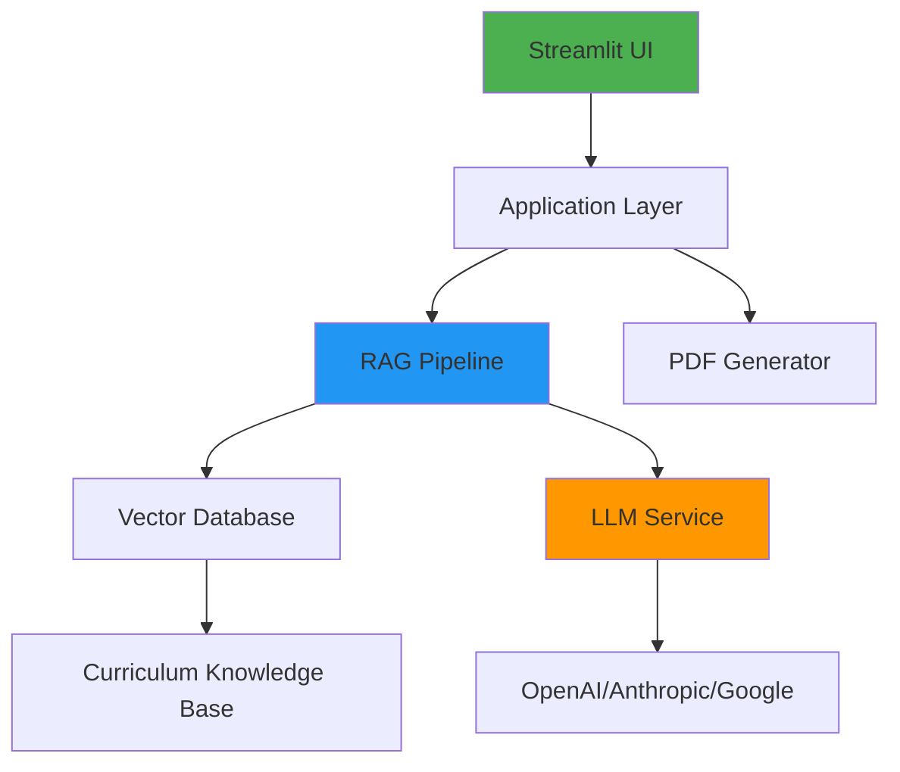
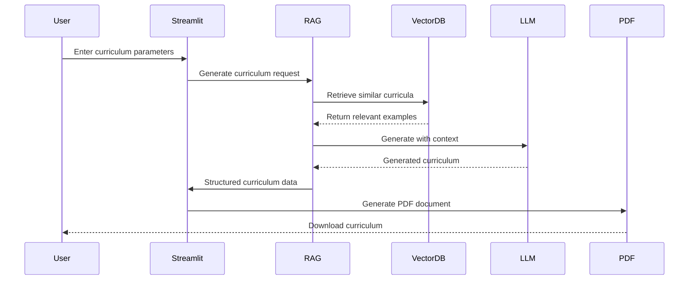

# GenAI Curriculum Generator - Modern Tech Stack Recommendation

**AI-Powered Educational Curriculum Design with Python, Streamlit & RAG**

---

## 📋 Executive Summary

This document provides a **modern, production-ready tech stack** for building the GenAI Curriculum Generator using:
- **Python** as the core language
- **Streamlit** for rapid UI development
- **RAG (Retrieval-Augmented Generation)** for intelligent curriculum generation

> [!IMPORTANT]
> This recommendation **replaces** the Flask + Ollama + Granite stack from the original document with a more modern, scalable, and easier-to-implement solution.

---

## 🏗️ Architecture Overview



**Key Principles:**
1. **Simplicity First**: Streamlit eliminates frontend complexity
2. **Cloud-Native**: Use managed LLM services instead of local models
3. **RAG-Powered**: Leverage curriculum knowledge base for accurate generation
4. **Production-Ready**: Easy deployment and scaling

---

## 🎯 Core Technology Stack

### 1. **Frontend & Application Framework**

#### **Streamlit** (Primary Choice)
- **Why**: Zero frontend code, rapid development, built-in state management
- **Version**: `streamlit >= 1.30.0`
- **Key Features**:
  - Built-in form handling
  - Native PDF download support
  - Session state management
  - Responsive by default
  - Easy deployment

**Alternative**: Gradio (if you prefer component-based UI)

---

### 2. **LLM Service** (RAG Component)

#### **Recommended: OpenAI GPT-4** or **Anthropic Claude 3.5 Sonnet**

**Option A: OpenAI (Easiest)**
```python
# Library: openai >= 1.0.0
from openai import OpenAI
```
- **Model**: `gpt-4-turbo` or `gpt-4o`
- **Pros**: Best documentation, reliable, fast
- **Cost**: ~$0.01 per curriculum generation
- **Setup**: 5 minutes with API key

**Option B: Anthropic Claude (Best Quality)**
```python
# Library: anthropic >= 0.18.0
from anthropic import Anthropic
```
- **Model**: `claude-3-5-sonnet-20241022`
- **Pros**: Superior reasoning, longer context (200K tokens)
- **Cost**: Similar to OpenAI
- **Best For**: Complex curriculum structures

**Option C: Google Gemini (Free Tier Available)**
```python
# Library: google-generativeai >= 0.3.0
import google.generativeai as genai
```
- **Model**: `gemini-1.5-pro`
- **Pros**: Free tier (60 requests/min), good quality
- **Cost**: Free for development
- **Best For**: Budget-conscious projects

> [!TIP]
> **Recommendation**: Start with **Google Gemini** for free development, switch to **Claude 3.5 Sonnet** for production quality.

---

### 3. **Vector Database** (RAG Component)

#### **Recommended: Chroma** (Local, Simple)

```python
# Library: chromadb >= 0.4.0
import chromadb
```

**Why Chroma?**
- ✅ Zero configuration
- ✅ Runs locally (no external service)
- ✅ Perfect for RAG applications
- ✅ Persistent storage
- ✅ Built-in embedding support

**Alternative Options:**

| Database | Best For | Complexity |
|----------|----------|------------|
| **Chroma** | Local development, simple RAG | ⭐ Easy |
| **Pinecone** | Production, cloud-native | ⭐⭐ Medium |
| **Weaviate** | Advanced features, hybrid search | ⭐⭐⭐ Complex |
| **FAISS** | High performance, research | ⭐⭐ Medium |

> [!NOTE]
> For this project, **Chroma** is the best choice due to simplicity and local deployment.

---

### 4. **Embedding Model** (RAG Component)

#### **Recommended: OpenAI Embeddings** or **Sentence Transformers**

**Option A: OpenAI Embeddings (Cloud)**
```python
# Included in openai library
model = "text-embedding-3-small"
```
- **Pros**: High quality, consistent with GPT-4
- **Cost**: $0.00002 per 1K tokens (very cheap)

**Option B: Sentence Transformers (Local, Free)**
```python
# Library: sentence-transformers >= 2.2.0
from sentence_transformers import SentenceTransformer
model = SentenceTransformer('all-MiniLM-L6-v2')
```
- **Pros**: Completely free, runs locally
- **Cons**: Slightly lower quality than OpenAI

> [!TIP]
> Use **Sentence Transformers** for free local development, **OpenAI Embeddings** for production.

---

### 5. **RAG Framework**

#### **Recommended: LangChain**

```python
# Library: langchain >= 0.1.0
from langchain.chains import RetrievalQA
from langchain.vectorstores import Chroma
from langchain.embeddings import OpenAIEmbeddings
```

**Why LangChain?**
- ✅ Industry standard for RAG
- ✅ Built-in RAG pipeline components
- ✅ Easy integration with all LLMs
- ✅ Excellent documentation
- ✅ Active community

**Alternative: LlamaIndex** (if you prefer simpler API)

---

### 6. **PDF Generation**

#### **Recommended: ReportLab** (as in original doc)

```python
# Library: reportlab >= 4.0.0
from reportlab.lib.pagesizes import letter
from reportlab.platypus import SimpleDocTemplate
```

**Why ReportLab?**
- ✅ Professional PDF output
- ✅ Full control over layout
- ✅ Industry standard

**Alternative: WeasyPrint** (HTML to PDF, easier styling)

---

### 7. **Document Processing** (for Knowledge Base)

```python
# Libraries for curriculum knowledge base
pypdf2 >= 3.0.0          # PDF parsing
python-docx >= 1.0.0     # Word documents
markdown >= 3.5.0        # Markdown files
```

---

## 📦 Complete Dependencies

### `requirements.txt`

```txt
# Core Framework
streamlit>=1.30.0
python-dotenv>=1.0.0

# LLM Services (choose one or more)
openai>=1.0.0
anthropic>=0.18.0
google-generativeai>=0.3.0

# RAG Components
langchain>=0.1.0
chromadb>=0.4.0
sentence-transformers>=2.2.0

# Document Processing
pypdf2>=3.0.0
python-docx>=1.0.0
markdown>=3.5.0

# PDF Generation
reportlab>=4.0.0

# Utilities
pydantic>=2.0.0
requests>=2.31.0
```

---

## 🗂️ Project Structure

```
genai-curriculum-generator/
├── app.py                          # Main Streamlit application
├── requirements.txt
├── .env                            # API keys
├── .streamlit/
│   └── config.toml                 # Streamlit configuration
├── src/
│   ├── __init__.py
│   ├── rag/
│   │   ├── __init__.py
│   │   ├── vector_store.py        # Chroma vector database
│   │   ├── embeddings.py          # Embedding generation
│   │   └── retriever.py           # RAG retrieval logic
│   ├── llm/
│   │   ├── __init__.py
│   │   ├── client.py              # LLM client wrapper
│   │   └── prompts.py             # Curriculum generation prompts
│   ├── curriculum/
│   │   ├── __init__.py
│   │   ├── generator.py           # Main curriculum generation
│   │   ├── validator.py           # Curriculum validation
│   │   └── models.py              # Pydantic models
│   └── pdf/
│       ├── __init__.py
│       └── generator.py           # PDF generation
├── data/
│   ├── knowledge_base/            # Curriculum examples, templates
│   │   ├── ml_curricula/
│   │   ├── web_dev_curricula/
│   │   └── templates/
│   └── vector_db/                 # Chroma persistent storage
└── tests/
    └── test_curriculum.py
```

---

## 🔧 Implementation Architecture

### RAG Pipeline Design



### Key Components

#### 1. **Knowledge Base Setup**
```python
# Populate vector database with curriculum examples
from src.rag.vector_store import CurriculumVectorStore

store = CurriculumVectorStore()
store.add_documents([
    "Machine Learning Masters curriculum examples",
    "Web Development bootcamp templates",
    "Data Science program structures"
])
```

#### 2. **RAG Retrieval**
```python
# Retrieve relevant curriculum examples
relevant_curricula = store.similarity_search(
    query=f"Create {skill} curriculum for {level}",
    k=3  # Top 3 most relevant examples
)
```

#### 3. **LLM Generation with Context**
```python
# Generate curriculum with RAG context
from src.llm.client import LLMClient

llm = LLMClient(model="gpt-4-turbo")
curriculum = llm.generate_curriculum(
    parameters=user_input,
    context=relevant_curricula  # RAG context
)
```

---

## 🚀 Deployment Options

### Option 1: **Streamlit Community Cloud** (Easiest, Free)
- ✅ Free hosting
- ✅ One-click deployment from GitHub
- ✅ Automatic HTTPS
- ⚠️ Limited resources (1GB RAM)

**Best For**: Demos, prototypes, small-scale use

### Option 2: **Docker + Cloud Run** (Recommended for Production)
```dockerfile
FROM python:3.11-slim
WORKDIR /app
COPY requirements.txt .
RUN pip install -r requirements.txt
COPY . .
CMD streamlit run app.py --server.port 8080
```

**Deployment**:
- Google Cloud Run
- AWS App Runner
- Azure Container Apps

**Best For**: Production, scalable applications

### Option 3: **Hugging Face Spaces** (AI-Focused Hosting)
- ✅ Free tier available
- ✅ GPU support
- ✅ Great for AI apps

---

## 💰 Cost Estimation

### Development Phase (Free)
- Streamlit: Free
- Google Gemini: Free (60 req/min)
- Chroma: Free (local)
- Sentence Transformers: Free (local)

**Total: $0/month**

### Production Phase (Paid)
- Streamlit Cloud: $0 (Community) or $250/month (Teams)
- Claude 3.5 Sonnet: ~$3-5 per 1000 curricula
- OpenAI Embeddings: ~$0.20 per 1000 curricula
- Cloud Hosting: $10-50/month

**Total: ~$15-300/month** (depending on scale)

---

## ⚡ Quick Start Guide

### 1. **Setup Environment**
```bash
# Create project
mkdir genai-curriculum-generator
cd genai-curriculum-generator

# Create virtual environment
python -m venv venv
source venv/bin/activate  # Windows: venv\Scripts\activate

# Install dependencies
pip install streamlit openai langchain chromadb sentence-transformers reportlab
```

### 2. **Create `.env` File**
```bash
OPENAI_API_KEY=your_key_here
# or
ANTHROPIC_API_KEY=your_key_here
# or
GOOGLE_API_KEY=your_key_here
```

### 3. **Minimal Working Example**
```python
# app.py
import streamlit as st
from openai import OpenAI

st.title("🎓 GenAI Curriculum Generator")

# Input form
skill = st.text_input("Skill/Subject")
level = st.selectbox("Level", ["BTech", "Masters", "Diploma", "Certification"])
semesters = st.number_input("Number of Semesters", 1, 8, 4)

if st.button("Generate Curriculum"):
    client = OpenAI()
    response = client.chat.completions.create(
        model="gpt-4-turbo",
        messages=[{
            "role": "user",
            "content": f"Create a {semesters}-semester {level} curriculum for {skill}"
        }]
    )
    st.write(response.choices[0].message.content)
```

### 4. **Run Application**
```bash
streamlit run app.py
```

---

## 🎯 Why This Stack is Better

| Aspect | Original (Flask + Ollama) | Recommended (Streamlit + RAG) |
|--------|---------------------------|-------------------------------|
| **Setup Time** | 2-3 hours | 15 minutes |
| **Frontend Code** | HTML/CSS/JS required | Zero frontend code |
| **LLM Quality** | Local Granite 3.3 2B | GPT-4/Claude (SOTA) |
| **Accuracy** | Good | Excellent (RAG-enhanced) |
| **Deployment** | Complex (Ollama + Flask) | One-click (Streamlit Cloud) |
| **Cost (Dev)** | Free but requires 16GB RAM | Free with cloud APIs |
| **Scalability** | Limited (local model) | Unlimited (cloud LLMs) |
| **Maintenance** | High (model updates) | Low (managed services) |

---

## 🔐 Best Practices

### 1. **Environment Variables**
```python
# Never hardcode API keys
import os
from dotenv import load_dotenv

load_dotenv()
api_key = os.getenv("OPENAI_API_KEY")
```

### 2. **Caching for Performance**
```python
@st.cache_resource
def load_vector_store():
    return CurriculumVectorStore()
```

### 3. **Error Handling**
```python
try:
    curriculum = generate_curriculum(params)
except Exception as e:
    st.error(f"Generation failed: {str(e)}")
```

### 4. **Structured Output**
```python
from pydantic import BaseModel

class Curriculum(BaseModel):
    skill: str
    level: str
    semesters: int
    courses: list[Course]
```

---

## 📚 Learning Resources

- **Streamlit**: [docs.streamlit.io](https://docs.streamlit.io)
- **LangChain**: [python.langchain.com](https://python.langchain.com)
- **RAG Tutorial**: [LangChain RAG Guide](https://python.langchain.com/docs/use_cases/question_answering/)
- **Chroma**: [docs.trychroma.com](https://docs.trychroma.com)

---

## 🎓 Conclusion

This modern tech stack provides:
- ✅ **Faster development** (Streamlit vs Flask)
- ✅ **Better quality** (GPT-4/Claude vs local models)
- ✅ **RAG accuracy** (context-aware generation)
- ✅ **Easier deployment** (Streamlit Cloud)
- ✅ **Lower maintenance** (managed services)
- ✅ **Free development** (Gemini + local tools)

**Next Steps:**
1. Set up development environment
2. Create knowledge base with curriculum examples
3. Implement RAG pipeline with LangChain + Chroma
4. Build Streamlit UI
5. Test and deploy

> [!IMPORTANT]
> Start with the minimal working example above, then gradually add RAG capabilities and PDF generation. This incremental approach ensures you have a working prototype quickly.
